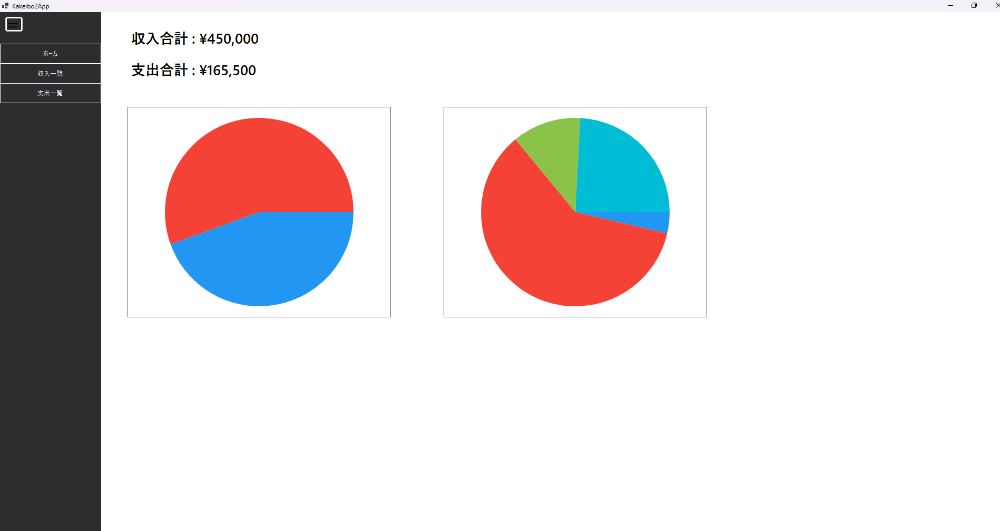
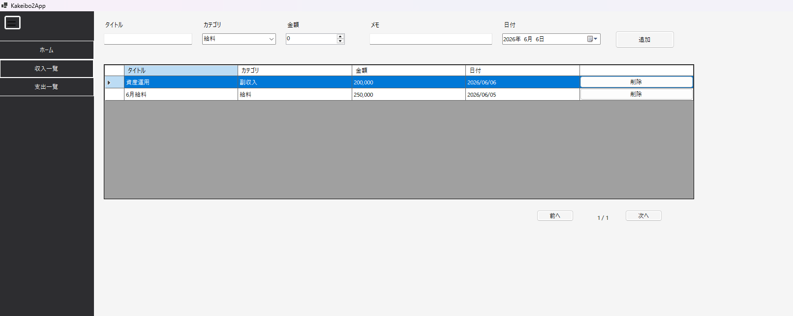
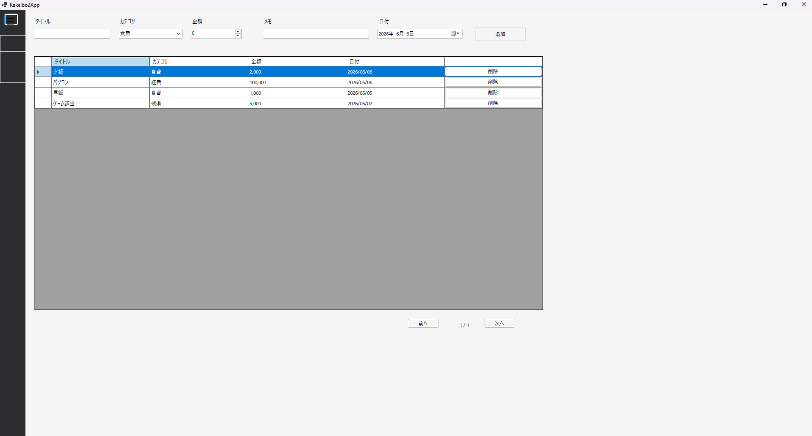

# 家計簿アプリ

## 概要

C# WinForms と SQLite を使用して作成した家計簿アプリです。

収入・支出の管理、データ保存、グラフ表示を行えます。

　　

## 使用技術

### C#

### .NET WinForms

### SQLite

### LiveChartsCore

　　
## 実装機能

### 収入登録

### 支出登録

### データ削除機能

### データ編集機能

### SQLite保存

### ページング機能

### 収入集計

### 支出集計

### 棒グラフ表示

### 円グラフ表示
　　

## 画面

### ホーム画面

収入・支出の合計とグラフを表示

### 収入管理

収入データの登録・削除・編集

削除ボタンを押すと"削除しますか？"と表示された小ウィンドウが表示される。

列をダブルクリックで編集フォームが表示される。

### 支出管理

支出データの登録・削除・編集

削除ボタンを押すと"削除しますか？"と表示された小ウィンドウが表示される。

列をダブルクリックで編集フォームが表示される。

　　
## 追加したかった機能

### CSV出力

### 検索機能

### 編集機能

### カテゴリの自由追加機能

　　
## 反省点

### 当初はデータベース設計を十分に考えず実装を進めてしまった

### 例外処理や入力チェックが不足している

### UI設計を後回しにしたため画面レイアウトの修正が多く発生した。

### コードの共通化を意識していたが、IncomePageとExpensePageで重複コードが多くなった。

　　
## 学んだこと

### C# WinFormsによるデスクトップアプリ開発

### SQLiteを利用したデータ永続化

### CRUD処理の実装

### UserControlを利用した画面切り替え

### GitHubを利用したソースコード管理
